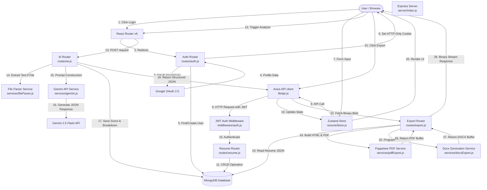

# Resume Curator — Architecture & Feature Implementation Guide

This document outlines the detailed system architecture, data flow paths, and feature implementation matrix for the **Resume Curator** application.

---

## 1. Data Flow Graph

The following Mermaid diagram visualizes the interactive data flow between the user interface, state management, backend controllers, external AI services, database, and export engines.

---

## 2. Feature Implementation Matrix

Below is a detailed breakdown of all user-facing and background features, showing their frontend components, backend routes, internal services, and database persistence layers.

### Auth & User Session Management
*   **Description:** Restricts access to user workspaces using a secure OAuth authentication loop. No local password storage is maintained.
*   **Frontend Files:** 
    *   [Home.jsx](file:///k:/Projects/Resume%20Curator/client/src/pages/Home.jsx): Houses landing page information and the Google OAuth redirection trigger.
    *   [App.jsx](file:///k:/Projects/Resume%20Curator/client/src/App.jsx): Features the `ProtectedRoute` wrapper component which invokes `getMe()` from [api.js](file:///k:/Projects/Resume%20Curator/client/src/lib/api.js) to assert session viability.
*   **Backend Files:**
    *   [auth.js (Routes)](file:///k:/Projects/Resume%20Curator/server/routes/auth.js): Configures passport strategy and serves `/api/auth/google`, `/api/auth/google/callback`, `/api/auth/me`, and `/api/auth/logout`.
    *   [auth.js (Middleware)](file:///k:/Projects/Resume%20Curator/server/middleware/auth.js): Unpacks client headers to check the HTTP-only `token` cookie and decodes the JWT signature.
*   **Data Models:** 
    *   [User.js](file:///k:/Projects/Resume%20Curator/server/models/User.js): Schema storing `googleId`, `email`, `name`, and profile `avatar` URL.

### Resume CRUD Workspace
*   **Description:** Standard database operations supporting multi-resume management. Includes duplicating existing resumes for customized role targeting.
*   **Frontend Files:**
    *   [Dashboard.jsx](file:///k:/Projects/Resume%20Curator/client/src/pages/Dashboard.jsx): Displays user's resume collection with grid-cards, featuring action menus (Open, Duplicate, Delete).
    *   [resumeStore.js](file:///k:/Projects/Resume%20Curator/client/src/store/resumeStore.js): Manages list updating and state changes before pushing changes through Axios.
*   **Backend Files:**
    *   [resume.js](file:///k:/Projects/Resume%20Curator/server/routes/resume.js): Exposes GET `/api/resume`, GET `/api/resume/:id`, POST `/api/resume`, PUT `/api/resume/:id`, DELETE `/api/resume/:id`, and POST `/api/resume/:id/duplicate`.
*   **Data Models:**
    *   [Resume.js](file:///k:/Projects/Resume%20Curator/server/models/Resume.js): Full structured resume model holding personal info, summary, experience arrays, education arrays, projects arrays, skills, target job description (targetJD), and historical ATS scores.

### Split-View Interactive Builder & Live Preview
*   **Description:** Implements side-by-side editing where form data updates state on every keystroke, reflecting instantly inside the visual A4 bounding box on the right.
*   **Frontend Files:**
    *   [Builder.jsx](file:///k:/Projects/Resume%20Curator/client/src/pages/Builder.jsx): Orchestrates the split layout. Handles standard form tabs on the left and the preview module on the right.
    *   `client/src/components/form/`: Subcomponents for each form block ([PersonalInfo.jsx](file:///k:/Projects/Resume%20Curator/client/src/components/form/PersonalInfo.jsx), [Experience.jsx](file:///k:/Projects/Resume%20Curator/client/src/components/form/Experience.jsx), etc.).
    *   `client/src/components/preview/`:
        *   [ResumePreview.jsx](file:///k:/Projects/Resume%20Curator/client/src/components/preview/ResumePreview.jsx): Embeds page-exact CSS and wraps the chosen layout.
        *   [ClassicTemplate.jsx](file:///k:/Projects/Resume%20Curator/client/src/components/preview/ClassicTemplate.jsx): Serif-based layout with centered headings and airy typography.
        *   [ModernTemplate.jsx](file:///k:/Projects/Resume%20Curator/client/src/components/preview/ModernTemplate.jsx): Sans-serif layout featuring vertical highlight margins.
        *   [ProfessionalTemplate.jsx](file:///k:/Projects/Resume%20Curator/client/src/components/preview/ProfessionalTemplate.jsx): High-density corporate format with capitalized header rows.
*   **Database Interactions:**
    *   *Auto-Save Feature:* A debounced hook inside `Builder.jsx` triggers a PUT request to `/api/resume/:id` every 30 seconds if changes have marked the Zustand store as `isDirty`.

### AI ATS Score Analyzer
*   **Description:** Conducts detailed auditing against a job description (JD) across 8 target metrics.
*   **Frontend Files:**
    *   [Analyze.jsx](file:///k:/Projects/Resume%20Curator/client/src/pages/Analyze.jsx): The analysis cockpit containing a JD paste block and visual progress gauges.
    *   [ATSScoreCard.jsx](file:///k:/Projects/Resume%20Curator/client/src/components/ai/ATSScoreCard.jsx): Renders score breakdowns via SVGs.
*   **Backend Files:**
    *   [ai.js](file:///k:/Projects/Resume%20Curator/server/routes/ai.js) (`/score` route): Fetches the document contents, normalizes the schema into text blocks using `resumeToText()`, and prompts the Gemini service.
    *   [gemini.js](file:///k:/Projects/Resume%20Curator/server/services/gemini.js): Calls `gemini-2.5-flash` with a system role defining the target schema structure and parses the incoming response into clean JSON.
*   **Prompt Architecture:**
    Enforces a strict, JSON-only output mapping a 0-100 score matrix to category fields: `keywords`, `actionVerbs`, `quantification`, `formatting`, `sections`, `contactInfo`, `summaryRelevance`, and `readability`.

### AI Keyword Gap Analysis
*   **Description:** Compares skills/topics mentioned in the JD against the context of the resume, flagging keywords as *Matched* or *Missing*.
*   **Frontend Files:**
    *   [KeywordGapPanel.jsx](file:///k:/Projects/Resume%20Curator/client/src/components/ai/KeywordGapPanel.jsx): Renders color-coded indicator badges (green for matched, red for missing).
*   **Backend Files:**
    *   [ai.js](file:///k:/Projects/Resume%20Curator/server/routes/ai.js) (`/keywords` route): Runs keyword classification prompts comparing JD requirements to the resume's skills list and work history.

### AI Bullet Point Rewriter
*   **Description:** Provides inline improvement recommendations for resume accomplishments.
*   **Frontend Files:**
    *   [BulletRewriter.jsx](file:///k:/Projects/Resume%20Curator/client/src/components/ai/BulletRewriter.jsx): Accessible popup component next to work history bullet fields allowing users to rewrite points and review changes before applying.
*   **Backend Files:**
    *   [ai.js](file:///k:/Projects/Resume%20Curator/server/routes/ai.js) (`/rewrite` route): Optimizes input bullets using action verbs, metrics, and JD keywords.

### AI Summary Generator
*   **Description:** Writes tailored summary sections based on user history and job requirements.
*   **Frontend Files:**
    *   [SummaryGenerator.jsx](file:///k:/Projects/Resume%20Curator/client/src/components/ai/SummaryGenerator.jsx): UI block inside the summary input tab letting users generate and apply AI-written summaries.
*   **Backend Routes:** `/api/ai/summary` -> updates the database and populates the editor text field directly.

### Standalone ATS Checker
*   **Description:** Lets users upload a file (PDF/DOCX) and compare it to a JD without logging in or saving records.
*   **Frontend Files:**
    *   [ATSChecker.jsx](file:///k:/Projects/Resume%20Curator/client/src/pages/ATSChecker.jsx): Paste zone for JD along with drag-and-drop file inputs.
*   **Backend Routes:** `/api/ai/score-upload` using Multer file storage.
*   **Helper Services:**
    *   [fileParser.js](file:///k:/Projects/Resume%20Curator/server/services/fileParser.js): Decodes document streams (`pdf-parse` for PDFs, `mammoth` for DOCX files) to plain text.
    *   [gemini.js](file:///k:/Projects/Resume%20Curator/server/services/gemini.js): Audits extracted plain text against the JD.

### AI Resume Upload & Parser
*   **Description:** Automatically converts existing PDF or Word documents into structured JSON to prefill the builder database record.
*   **Backend Route:** `/api/resume/upload` (for creating a new database entry) and `/api/ai/parse-resume` (for populating current workspace).
*   **Helper Services:** [fileParser.js](file:///k:/Projects/Resume%20Curator/server/services/fileParser.js) processes file buffers, while [gemini.js](file:///k:/Projects/Resume%20Curator/server/services/gemini.js) maps text blocks to the structured MongoDB resume layout.

### Full Resume Optimizer (Updater)
*   **Description:** Rebuilds entire unstructured text resumes into highly structured, optimized profiles based on target job descriptions.
*   **Frontend Files:**
    *   [Updater.jsx](file:///k:/Projects/Resume%20Curator/client/src/pages/Updater.jsx): Puts side-by-side text input boxes in front of the user, calling the API to return a fully formatted resume.
*   **Backend Route:** `/api/ai/improve` invokes Gemini to return the fully structured resume object matching the MongoDB schema.

### PDF & DOCX Export Engines
*   **Description:** Exports print-exact A4 PDFs and clean, table-free DOCX files.
*   **Frontend Component:**
    *   [ExportButtons.jsx](file:///k:/Projects/Resume%20Curator/client/src/components/ExportButtons.jsx): Sends export requests to the server and triggers browser downloads.
*   **Backend Files:**
    *   [export.js](file:///k:/Projects/Resume%20Curator/server/routes/export.js): Handles routing and streams binary buffers to the client.
    *   [pdfExport.js](file:///k:/Projects/Resume%20Curator/server/services/pdfExport.js): Renders templates (Classic, Modern, Professional) as self-contained HTML strings and runs a Puppeteer headless browser instance to render and print them to PDF.
    *   [docxExport.js](file:///k:/Projects/Resume%20Curator/server/services/docxExport.js): Builds Word documents using the `docx` library. It uses tab stops for alignment, avoiding tables (which can confuse ATS parsers) and unicode bullets.
